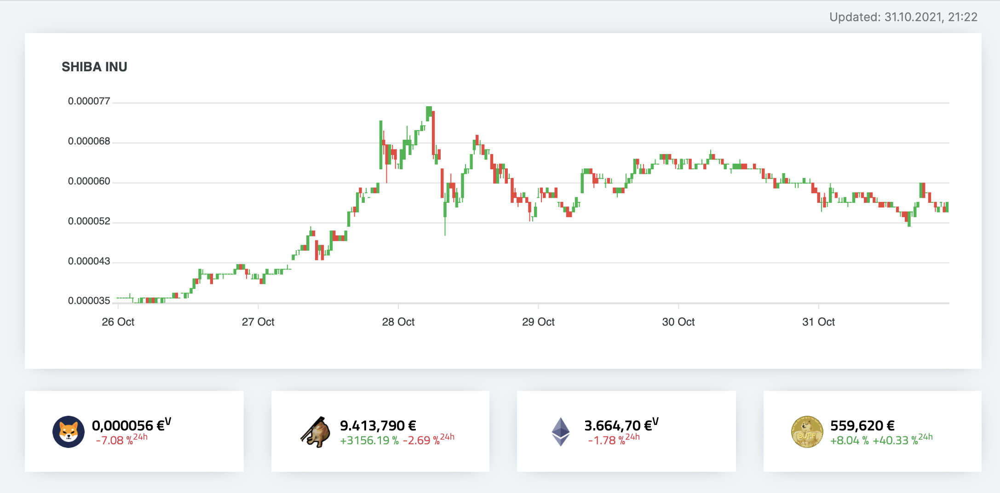

# 💰 Projet-3-Cryptomonnaie-Wild-Data-Hub

C'est le résultat du deuxième projet réalisé lors de ma formation en tant que _DATA ANALYST_ à la **Wild Code School** à Lille.

## 🎯 Objectif du Projet :

Le système de recommandation de films est mis en place pour le compte d'un gérant de cinéma de la Creuse afin de lui aider à choisir des films pour ses clients locaux.
Les KPIs sont définis pour évaluer les films susceptibles de correspondre aux goûts locaux.

1. Période de sortie des films :

Films sortis entre 1975 et 1995.

2. Nationalité des films :

Origine : Française et Américaine.

3. Catégories :

Films appartenant aux genres :
     Comédie,
     Famille,
     Drama
   
4. Notes des films :

Score supérieur ou égal à 6 /10 sur les plateformes de notation (e.g., IMDb, TMDB).

5. Durée des films :

À définir selon les préférences locales (proposer des durées moyennes entre 80 min et 240 min).

## ✅ Etapes : 

#### Semaine 1 :  
Appropriation et première exploration des données     
Outils principaux : jupyter, pandas, gzip   


#### Semaine 2 : 
Jointures, filtres, nettoyage,     
Outils principaux : jupyter, pandas


#### Semaine 3 : 
Recherche de corrélation, visualisation     
Outils principaux : google colab, pandas, seaborn, matplotlib


#### Semaine 4 :   
Machine learning, recommandations    
Outils principaux : google colab, scikit-learn, nltk


#### Semaine 5 :  
Affinage, présentation et Demo Day
Outils principaux : google colab, google slide, streamlit 


## 🎬 Source des Données :  
-[Données IMDb](https://datasets.imdbws.com/)   
-[Données TMDB](https://drive.google.com/file/d/1VB5_gl1fnyBDzcIOXZ5vUSbCY68VZN1v/view)   
-[Explication datasets](https://www.imdb.com/interfaces/)  


## 📎 Livrables

* Exploration et infiltrage des données : ouvrez les notebooks correspondants dans Jupyter : [Notebook](https://github.com/Sopanha2020/Projet-2-Group-Moving-Frame-Systeme-de-Recommandation-de-Films/blob/main/Notebooks/TMDB%20IMDB%20Data%20Wrangling.ipynb).  
* Nettoyage et visualisation des données : ouvrez les notebooks correspondants dans Google Colab : [Notebook](https://github.com/Sopanha2020/Projet-2-Group-Moving-Frame-Systeme-de-Recommandation-de-Films/blob/main/Notebooks/Film_Recommendation_System.ipynb).
* Application : ouvrez à partir de l'url suivante : [appli-streamlit](https://projet-2-group-moving-frame-systeme-de-recommandation-de-films.streamlit.app/). 

## 📡 Installation

0. Prérequis d'installation
    
    Python >= 2.12
    
1. Clonez le dépôt:
    ```sh
    git clone https://github.com/Sopanha2020/Projet-2-Group-Moving-Frame-Systeme-de-Recommandation-de-Films.git
    ```
2. Allez dans le répertoire du projet:
    ```sh
    cd Projet-2-Group-Moving-Frame-Systeme-de-Recommandation-de-Films
    ```
3. Installez les dépendances:
    ```sh
    pip install -r requirements.txt
    ```
4. Ajouter la clé API tmdb pour utilisation en local:  
    ```
    Copier votre clé API tmdb dans le fichier api.txt
    ```
5. Lancer l'application en local:
    ```sh
    streamlit run app.py
    ```
# Crypto Tracker 🐍📈 – Central Portfolio Tracking

[](https://www.python.org/) 
[](https://www.djangoproject.com/) 

### Easy asset tracking – at a glance 🚀



Dashboard to centrally monitor current crypto portfolio developments, by providing an overview of their current value.
Values can either be displayed by their current *Overall value* (requires adding Purchases) or by their *Current value*
(indicated by the <sup>`V`</sup> next to the number).

The current course data is polled from CoinMarketCap's REST API and stored in the database. The API allows you to make 
a maximum of 333 points worth of daily requests (~1 request / 5min). Querying multiple cryptos may increase the 
amounts of points required per API call, thus requires increasing the time between requests.

## ⭐ Features

💸 Personalized crypto portfolio tracking  
💸 Centrally keep an eye on its current value  
💸 Quickly react to emerging changes  
💸 Show overall or current value  
💸 Convert values into local currency  
💸 Chart crypto course  
💸 Soon: alerting via Pushover  

## Deployment 👾

Deployment is best done via Docker – can also be achieved by installing each component manually,
but this is quite tedious, so I'm not going to detail that here.

This application is meant to be run behind e.g. Traefik or a WAF (Web Application Firewall) that handles 
the SSL certificates, such as LetsEncrypt.

Once rolled out the application is reachable via `http://<ip-address>:5000`

### Requirements

* [Docker](https://docs.docker.com/get-docker/)  
* [docker-compose](https://docs.docker.com/compose/install/)  
* [CoinMarketCap API Key](https://coinmarketcap.com/api/)

### Setup

All relevant parameters are controlled via environment variables that are passed
to the docker-compose stack. For further reference review the `config/settings.py` file.

```bash
mv dotenv-sample .env
vi .env
```

* `SECRET_KEY` just set it
* `POSTGRES_PASSWORD` database password
* `SITE_HOSTNAME` name your site is going to be reached at. Multiple values can be space-separated
* `ALLOWED_HOSTS` allowed host headers - should have `SITE_HOSTNAME` values + IPv4 of your Docker host  
* `COINMARKET_KEY` your CoinMarketCap API key used for requests
* `TARGET_CURRENCY` if you wish to convert the USD course + price data to your local currency

### Docker Rollout

```bash
mv docker/docker-compose .
mv docker/rebuild-shortcut rebuild
chmod +x ./rebuild
./rebuild
```

Everything should now be running smoothly. Use a service (`cron` will also do) to start
the process automatically at boot. Alternatively you can also add `-d` to the `docker-compose`
command in `rebuild` and run it manually at each startup.

## Usage 🚀

Once running, access the admin panel via `http://<ip-address>:5000/admin` 
To access it, you will need to create a user using `chmod +x docker/manage-shortcut; ./docker/manage-shortcut createsuperuser`  

Login with the credentials just created, to then add the `Cryptos` you wish to track. 
Once added, `Purchases` enable you to indicate your assets/amount for each crypto.


[](https://www.buymeacoffee.com/alfonsrv)  

---

## TODOs 🛠️

- Resize image  
- Price Alerting

